# Top 12 International Money Transfer Services Ranked in 2025 (Latest Compilation)

Sending money across borders shouldn't feel like you're navigating a maze blindfolded. Whether you're supporting family overseas, paying contractors in different countries, or managing expenses while traveling, finding a reliable way to move money internationally matters more than ever. The right platform saves you hundreds in hidden markups, gets your funds there faster, and keeps the whole process transparent enough that you actually understand where your money goes.

This guide covers twelve platforms that handle international transfers with varying strengths—from peer-to-peer marketplaces that let you control exchange rates to instant digital wallets and traditional cash pickup networks. Each service tackles the same core problem differently, so you'll find options whether you're moving large property payments or quick $100 transfers to friends abroad.

---

## **[CurrencyFair](https://currencyfair.com)**

The peer-to-peer marketplace where you set your own exchange rate targets.

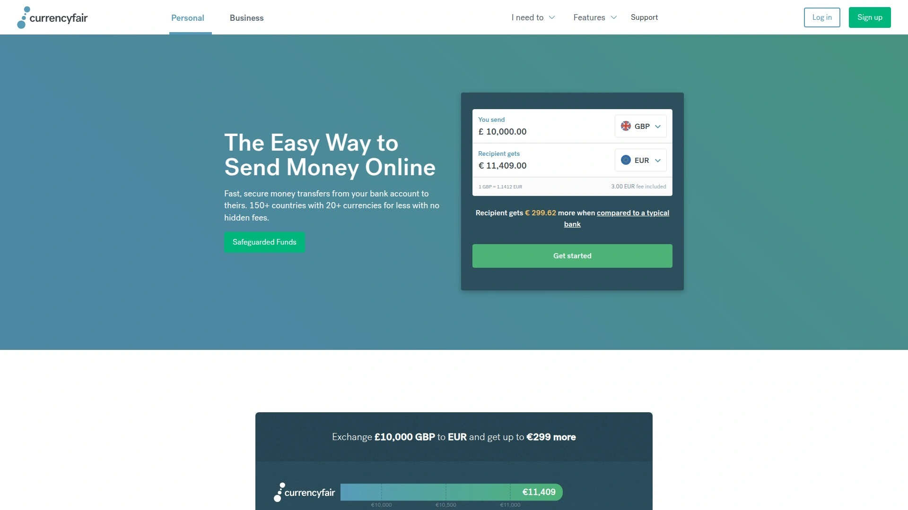

CurrencyFair operates on an innovative model that connects people who want to exchange currencies directly with each other. Instead of accepting whatever rate a company offers, you can place an order at your preferred rate and wait for someone on the other side to match it. This marketplace approach has helped customers save significantly since 2010, with over €10 billion exchanged through the platform.

The service charges a flat €3 fee per transfer (or currency equivalent), plus an average exchange rate markup of 0.53%. You can send money to 150+ countries in more than 20 currencies, with same-day delivery available for most major currency routes. What makes this particularly useful for property buyers or people making large transfers is the ability to set rate alerts—you get notified when your target rate becomes available, letting you time your transfer strategically rather than rushing into unfavorable rates.

The platform works through both web and mobile apps, fully regulated by the Central Bank of Ireland. Customer funds sit in segregated accounts at Tier 1 international banks, and the company maintains bank-grade security protocols. For anyone who wants more control over their exchange rate and doesn't mind waiting a bit for optimal pricing, this marketplace model offers something genuinely different from standard instant-transfer services.

***

## **[Wise](https://wise.com)**

Fast international transfers using the mid-market rate with transparent pricing.

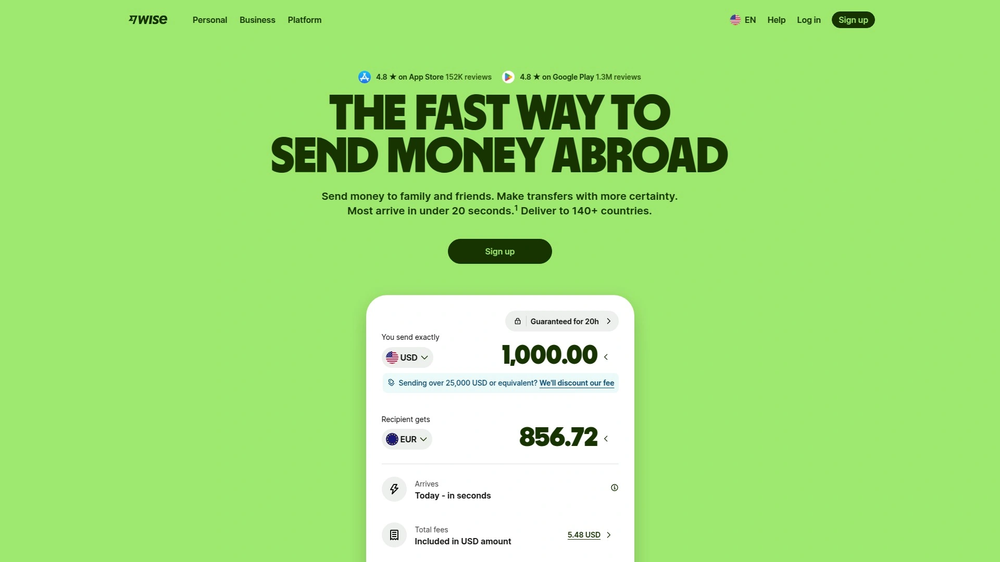

Wise built its reputation on one simple promise: use the real mid-market exchange rate with no markup. Their system matches transfers between users in different countries internally, which means your money often doesn't actually cross borders at all—just the records change hands. This clever approach lets them offer rates you'd see on Google or financial news sites, something traditional banks rarely do.

Transfer speeds have gotten impressively fast—70% of payments now arrive in under 20 seconds, and over 50% of all transfers complete instantly. The fee structure varies depending on the currency pair and amount, typically starting around 0.33% for many routes. You can send up to $1 million per wire transaction to 160+ countries.

Beyond basic transfers, Wise offers multi-currency accounts that let you hold over 40 currencies simultaneously, get local bank details in multiple countries, and use a debit card for spending abroad. This makes it particularly useful for digital nomads, freelancers receiving international payments, or anyone who regularly deals with multiple currencies. The transparency extends to showing you historical exchange rates right in the app, so you can see if you're getting a good deal.

***

## **[OFX](https://www.ofx.com)**

No transfer fees on amounts over $150, with competitive rates for larger transactions.

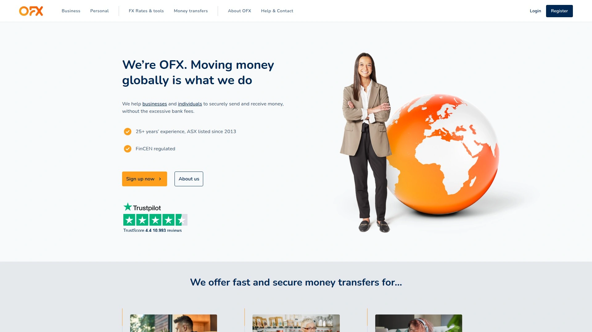

OFX specializes in medium to large international transfers, standing out by charging zero transfer fees while offering exchange rates typically 1-2% above the interbank rate. This pricing model works especially well when you're moving substantial amounts—the percentage-based savings compound as transfer sizes increase. The minimum transfer is $150, which signals their focus on more significant transactions rather than small casual sends.

Transfers typically complete within 1-3 business days for major currency routes, though some exotic currency pairs can take up to five days. There's no upper limit on transfer amounts for established customers, making this a go-to choice for property purchases, business payments, or large family support transfers. The platform covers over 50 currencies across 170+ countries.

The service includes 24/7 customer support by phone in major markets, which becomes valuable when you're moving life-changing amounts of money and want to speak with an actual human. You can set rate alerts to monitor when favorable exchange rates appear, then execute transfers when timing works in your favor. OFX holds regulations from financial authorities including the FCA in the UK, ASIC in Australia, and FinCEN in the US.

***

## **[Remitly](https://www.remitly.com)**

Choose between express and economy speeds based on urgency and budget.

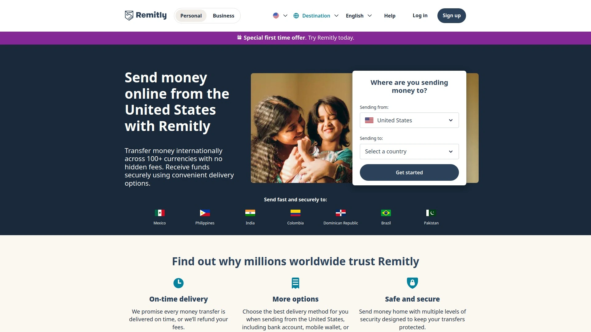

Remitly gives you actual control over the speed-versus-cost tradeoff. Their Express option delivers money in minutes but costs more, while Economy delivery takes 1-5 business days with significantly lower fees. This flexibility matters when you're deciding between "my cousin needs rent money today" versus "I'm sending next month's support payment and can wait."

The platform serves 170+ countries with multiple delivery options: bank deposits, cash pickup at physical locations, mobile money transfers, or even home delivery in certain markets. Recipients can collect at Western Union agent locations and various partner banks, giving them flexibility even in areas with limited banking infrastructure.

Debit card payments offer a balance between speed and cost, while bank transfers generally come cheapest, especially on Economy delivery. Exchange rates display clearly before you confirm, with real-time updates so you know exactly what the recipient gets. The app and website make the whole process straightforward—snap a photo of an invoice or enter details manually, schedule according to your cash flow, and track the transfer all the way through.

***

## **[XE Money Transfer](https://www.xe.com)**

Backed by decades of currency data expertise and exchange rate tracking tools.

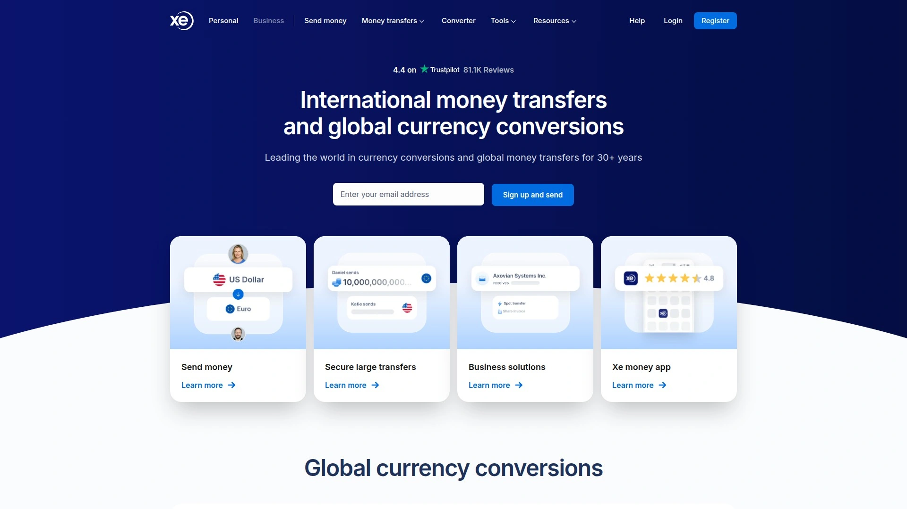

XE leveraged its history as the internet's go-to currency converter into a full money transfer service. Their reputation for accurate, real-time exchange rate data carries over into competitive transfer pricing, often beating traditional banks on both rates and fees. You can send money to over 190 countries in more than 130 currencies.

About 90% of XE transfers arrive within minutes when using faster payment methods, though bank transfers can take longer. The platform offers various payment options including bank transfers, debit cards, and credit cards, with fees and speeds varying based on your choice. Being part of the Euronet Worldwide family adds regulatory backing and infrastructure.

What sets XE apart is the surrounding toolset—currency charts showing historical rates, rate alerts for monitoring specific currency pairs, and extensive educational resources about foreign exchange. If you're the type who wants to understand currency movements before committing to a transfer, or you need to time business payments around favorable rates, these research tools add genuine value beyond the basic send-money function.

***

## **[Western Union](https://www.westernunion.com)**

Massive global network combining digital transfers with physical cash pickup locations.

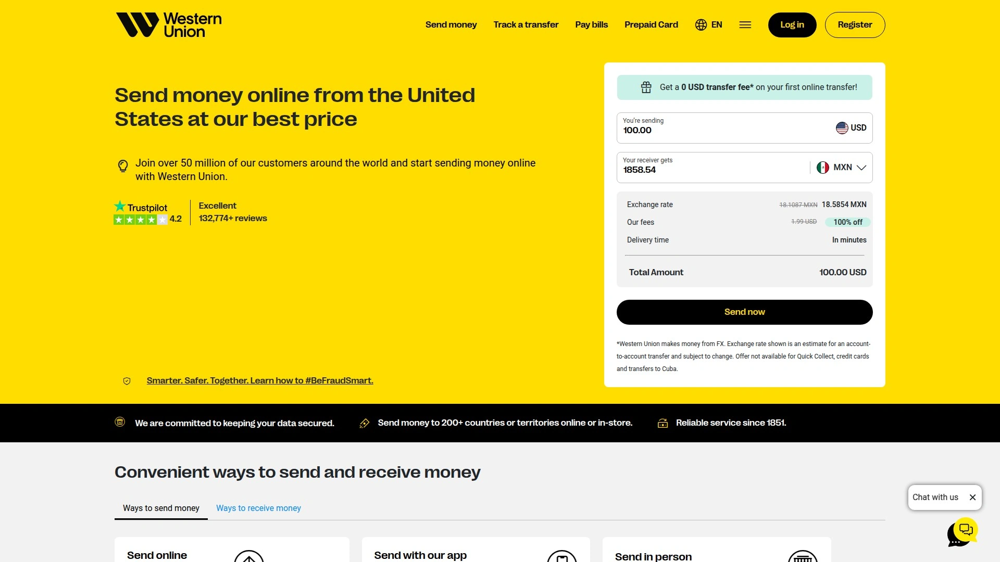

Western Union's main advantage is sheer reach—over 200 countries and territories with extensive physical agent networks. This matters enormously in regions where banking infrastructure remains limited. Someone can send money online from Chicago, and their grandmother in a rural village can pick up cash at a local agent the same day.

Fees and exchange rate markups vary widely based on how you send, how they receive, and where the money goes. Transfers funded by debit or credit cards and sent for cash pickup typically arrive same-day but cost more. Cheaper bank-to-bank transfers can take up to a week for delivery. Online transfers max out at $5,000 for many countries.

The platform works through website, mobile app, and in-person locations, giving you flexibility to start transactions however suits you best. While fees and rate markups often run higher than digital-first competitors, that extensive physical network and multiple delivery options create real value for sending to less-developed regions or situations where recipients lack bank accounts.

***

## **[MoneyGram](https://www.moneygram.com)**

Schedule recurring transfers with flexible delivery and cash pickup options.

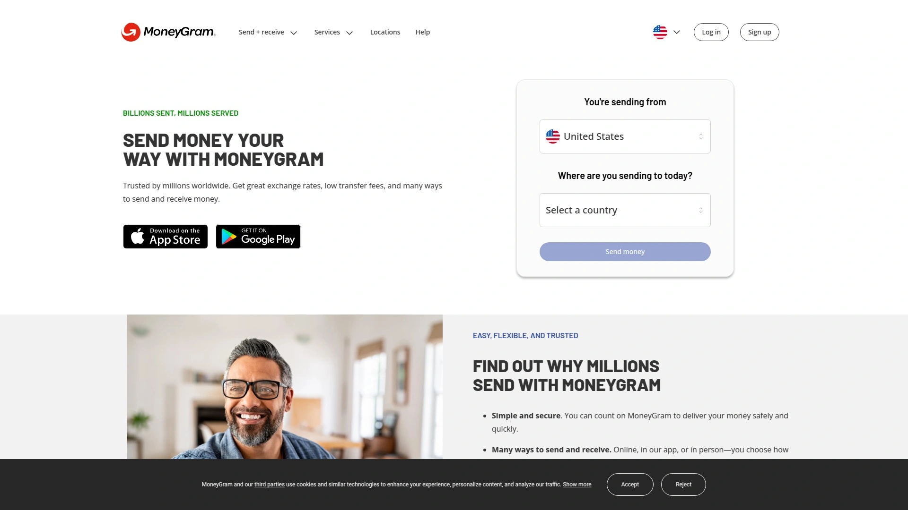

MoneyGram handles money transfers to 200+ countries and territories with a particular strength in scheduled recurring payments. If you're supporting family monthly or making regular business payments, setting up automatic transfers saves time and ensures consistency. This scheduling feature stands out among money transfer services.

Upfront fees for debit card-funded transfers typically stay low or free, though other payment methods see higher charges. Exchange rate markups vary depending on destination and can exceed 2%. Online transfers max out at $10,000 per transaction and $10,000 every 30 days for most countries.

Delivery options include bank deposits, mobile wallet transfers, and cash pickup at physical locations. The mobile app has millions of downloads and handles the full transfer process smoothly—set destination, enter amount, provide recipient details, choose delivery method, and pay. Real-time tracking keeps you updated throughout, and both sender and recipient get confirmation notifications when the transfer completes.

***

## **[Revolut](https://www.revolut.com)**

Digital banking app with instant peer-to-peer transfers and multi-currency accounts.

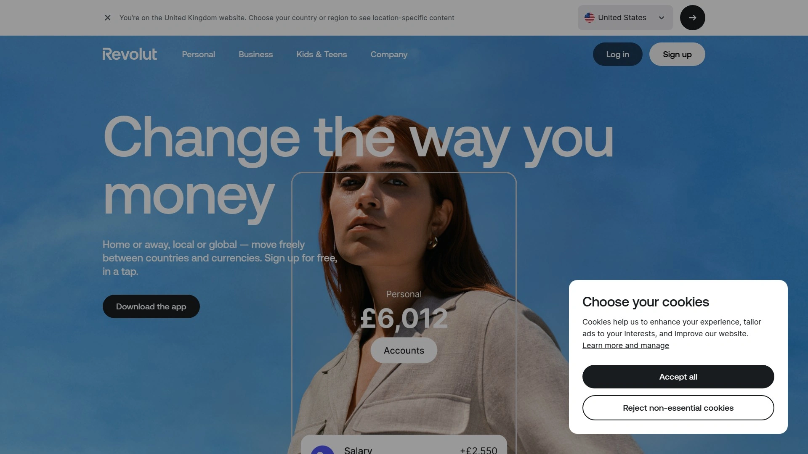

Revolut approaches international transfers as one feature within a broader digital banking ecosystem. Transfers between Revolut users arrive in 20 seconds or less with no transfer fees—just potential exchange fees depending on when you send and your plan limits. This makes it phenomenally useful if your regular recipients also use the platform.

For bank transfers to non-Revolut accounts, you'll pay either up to 5% of the transaction amount or a fixed fee up to $10 USD, whichever is greater. The service reaches 140+ countries from the US, with faster delivery for card-funded transfers versus slower bank-to-bank options. Exchange rates stay favorable during weekday hours (6pm EST Sunday through 5pm EST Friday), with additional markups applying on weekends.

The multi-currency account lets you hold balances in multiple currencies, get local bank details in various countries, and use a debit card for international spending without heavy foreign transaction fees. This full-package approach works best if you want combined banking, spending, and transfer capabilities rather than just single-purpose money movement.

***

## **[Xoom](https://www.xoom.com)**

PayPal-owned service with instant account-to-account transfers and mobile wallet delivery.

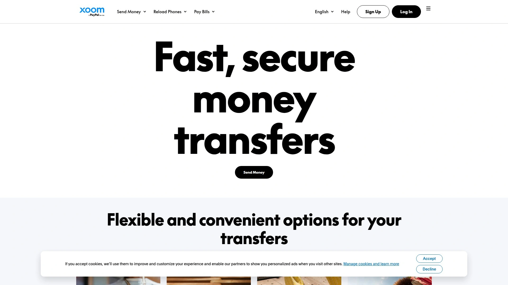

Xoom integrates tightly with PayPal, letting you fund transfers from your PayPal balance, linked bank account, debit card, or credit card. If you already live in the PayPal ecosystem, this seamless connection simplifies funding. You can send to approximately 160 countries with delivery options including bank deposits, cash pickup at thousands of locations, mobile wallet transfers, and even prepaid phone top-ups.

Transaction fees vary based on destination country, currency exchange rates, transfer amount, and funding source. Generally, minimum transfers start at $10, with maximums of $2,999 in 24 hours, $6,000 in 30 days, and $9,999 in 180 days. Exchange rate markups typically run 1-3% above mid-market rates.

Most Xoom transfers arrive within minutes, though some take several days depending on payment intermediaries involved. The platform provides email and text updates throughout, plus online tracking so you always know transfer status. For existing PayPal users sending to countries with strong mobile wallet adoption, Xoom's delivery flexibility offers genuine convenience.

***

## **[Paysend](https://paysend.com)**

Flat-fee transfers to cards, bank accounts, and mobile wallets across 170+ countries.

Paysend keeps pricing straightforward with a flat €1.50 (or local currency equivalent) fee for most transfers. This transparent, non-percentage-based pricing means you know upfront what you'll pay regardless of transfer size. The service reaches over 170 countries with multiple delivery methods—direct to bank accounts, cards, mobile wallets, or cash pickup depending on the destination.

A distinctive feature is card-to-card transfers, where you send money directly from your card to someone's Visa, Mastercard, or UnionPay card. Most transfers complete within minutes, getting money to recipients quickly when they need it. Exchange rates update in real-time so you see exactly what arrives on the other end.

The platform serves over 10 million customers globally with enterprise-grade security, PCI DSS compliance, and 24/7 support. Paysend is regulated by the Financial Conduct Authority in the UK, adding regulatory oversight and consumer protection. Some routes offer zero-fee bank transfers, helping you save even more when supporting family or friends abroad.

***

## **[WorldRemit](https://www.worldremit.com)**

Fast money transfers with cash pickup, mobile money, and airtime top-up options.

WorldRemit specializes in sending money from over 50 countries to more than 150 destinations worldwide, with particular strength in African and Asian markets. Delivery methods include bank deposits (usually arriving within minutes), cash pickup at partner locations, mobile money transfers to services like M-Pesa and MTN, and airtime top-ups for mobile phones.

The service charges no account maintenance fees—you only pay transaction fees and currency exchange markups when actually sending money. Transfer fees typically range from $1.99 to $3.99 depending on amount, destination, and delivery method, with exchange rate markups between 0.9-3%. Online and app-based transfers keep the process simple: choose destination, select delivery method, enter amount, add recipient details, and pay.

Real-time tracking shows exactly where your money is throughout the transfer process, with SMS or email alerts when delivery completes. The app has received over 125,000 five-star reviews and 90,000 Trustpilot reviews, indicating generally positive user experiences. For sending money to regions with strong mobile money adoption or where recipients need cash pickup flexibility, WorldRemit's delivery options provide practical solutions.

***

## **[Instarem](https://www.instarem.com)**

Transparent rates and low fees with bank-grade security for overseas transfers.

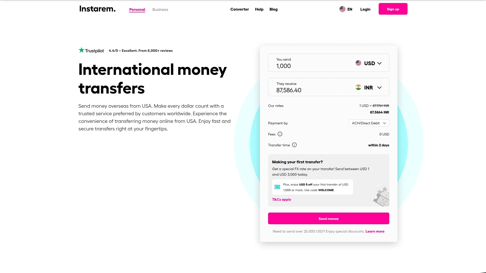

Instarem emphasizes transparency by displaying exact exchange rates and fees upfront through their website calculator. You see the complete cost before committing, with no hidden markups sneaking into the final amount. The service operates as part of fintech unicorn Nium, providing infrastructure backing and regulatory licenses across 11 jurisdictions.

Transfers complete in minutes for most routes, with bank-grade security and real-time tracking throughout the process. The platform keeps fees low and transparent compared to traditional bank transfers, offering better-than-bank foreign exchange rates without surprise charges. Creating an account takes just minutes—sign up through Google, Facebook, or email, verify your mobile number, and upload identification documents.

The service works for both individuals and businesses, handling everything from family support transfers to international vendor payments. Over one million customers use Instarem globally, attracted by the combination of competitive rates, speed, and regulatory compliance. First-time users often receive special offers like zero fees or better rates on initial transfers.

***

## **[TransferMate](https://www.transfermate.com)**

Business-focused international payments with localized solutions and API integration.

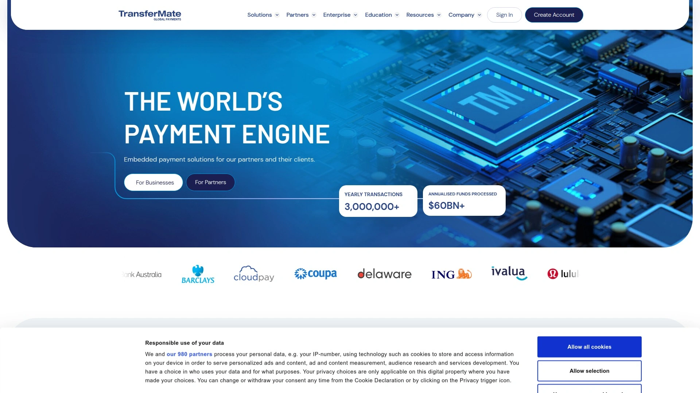

TransferMate targets business-to-business payments rather than consumer transfers, operating the world's largest fintech payments network with 92 licenses globally. This extensive licensing allows them to make localized payments that save time and money compared to traditional SWIFT wires. The platform handles payments in 140+ currencies across 200+ countries and territories.

The service eliminates hidden fees and offers preferential exchange rates with complete transparency—fees and FX calculations appear upfront, and reconciliation happens automatically. For businesses processing payroll globally or paying international contractors, TransferMate provides native integrations that automate everything from compliance and payouts to confirmations.

Their API solutions let companies integrate payment infrastructure directly into existing systems, reducing manual errors and enhancing efficiency. Dedicated payment experts provide personalized support for setup and troubleshooting. The platform handles both single large payments (useful for property purchases or major supplier invoices) and mass payment processing for companies dealing with high transaction volumes.

***

## FAQ

**How quickly do international money transfers typically arrive?**

Transfer speed varies dramatically based on the service and payment method you choose. Instant options like Wise-to-Wise or Revolut-to-Revolut transfers arrive in seconds, while bank-funded economy transfers can take 1-5 business days. Most services show estimated delivery times before you confirm, so check that timeline against your urgency before committing to a particular method.

**What's the real cost of sending money internationally?**

Look at both explicit fees and exchange rate markups together—some platforms advertise low fees but hide costs in poor exchange rates. Calculate the total amount your recipient actually receives, then compare that across services. Platforms using mid-market rates with transparent fees (like Wise) often cost less overall than services with "zero fees" but marked-up exchange rates.

**Should I use a specialized transfer service or my bank?**

Banks typically charge significantly higher fees and use less favorable exchange rates than specialized transfer services. International transfer platforms save you money by focusing specifically on cross-border payments rather than bundling them as an afterthought to traditional banking. The difference compounds on larger transfers—what might be a few dollars on small amounts becomes hundreds on property payments or major transfers.

***

## Conclusion

Finding the right international money transfer service depends on what matters most for your specific situation—whether that's absolute lowest cost, fastest delivery, widest reach, or flexibility in how recipients collect funds. Each platform in this guide brings particular strengths to different scenarios.

For anyone wanting control over exchange rates through a peer-to-peer marketplace model, [CurrencyFair](https://currencyfair.com) stands out as the top choice. Its rate-targeting system and transparent €3 flat fee work especially well for property buyers, expats making regular large transfers, or anyone willing to wait briefly for optimal pricing rather than accepting whatever rate appears at the moment. The ability to set rate alerts and execute transfers when markets move in your favor gives you genuine agency in an industry where most services simply present a take-it-or-leave-it rate.
